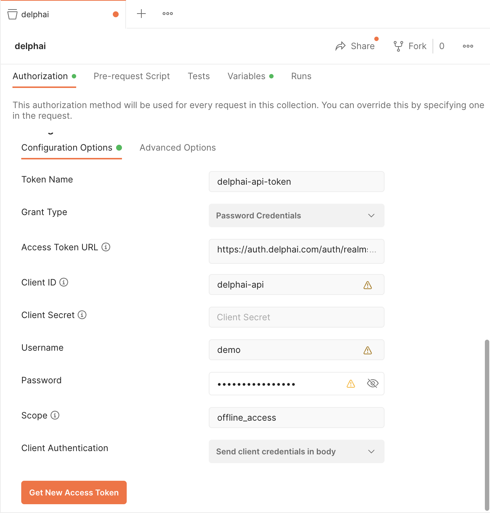

# Overview

The delphai API utilises the [OAuth 2.0](https://oauth.net/2/) protocol to authorize requests. The API uses [Resource Owner Password Credentials Grant](https://www.rfc-editor.org/rfc/rfc6749#section-4.3) to authenticate users, and the tokens endpoint is located at https://auth.delphai.com/auth/realms/delphai/protocol/openid-connect/token. The client ID for the API is `delphai-api`.

If you're going to use refresh tokens, a permanent refresh token could be requested with `offline_access` scope. Otherwise its lifetime is one week.

The token should be passed following the [Bearer Authentication scheme](https://swagger.io/docs/specification/authentication/bearer-authentication/) in the Authorization HTTP header.


## Authentication Examples

In the following examples, the `client_secret` parameter is not needed as the API is using __password credentials flow__ to authenticate. The username and password parameters are set to _demo_ for demonstration purposes.

### Python with requests
```python
import requests

# Authenticate and get access token
token_url = 'https://auth.delphai.com/auth/realms/delphai/protocol/openid-connect/token'
client_id = 'delphai-api'
username = 'demo'
password = 'demo'
payload = {
    'grant_type': 'password',
    'client_id': client_id,
    'username': username,
    'password': password,
}
response = requests.post(token_url, data=payload)
response.raise_for_status()
access_token = response.json()['access_token']

# Authenticate API request
api_url = 'https://api.delphai.com/v1/companies/5c7fe4f53807d86e3a9e47cf'
headers = {"Authorization": f"Bearer {access_token}"}
response = requests.get(api_url, headers=headers)
response.raise_for_status()
print(response.json())
```

### Python with oauthlib
```python
from oauthlib.oauth2 import LegacyApplicationClient
from requests_oauthlib import OAuth2Session

# Authenticate and get access token
token_url = 'https://auth.delphai.com/auth/realms/delphai/protocol/openid-connect/token'
client_id = 'delphai-api'
client_secret = ''
username = 'demo'
password = 'demo'
client = LegacyApplicationClient(client_id=client_id)
oauth = OAuth2Session(client=client)
token = oauth.fetch_token(token_url=token_url, client_id=client_id, client_secret=client_secret,
                          username=username, password=password)

# Authenticate API request
api_url = 'https://api.delphai.com/v1/companies/5c7fe4f53807d86e3a9e47cf'
headers = {"Authorization": f"Bearer {token['access_token']}"}
response = oauth.get(api_url, headers=headers)
print(response.json())
```

### TypeScript with simple-oauth2
```typescript
import { create } from 'simple-oauth2';
import axios from 'axios';

const credentials = {
  client: {
    id: 'delphai-api',
    secret: '',
  },
  auth: {
    tokenHost: 'https://auth.delphai.com',
    tokenPath: '/auth/realms/delphai/protocol/openid-connect/token',
  },
};

const oauth2 = create(credentials);

async function main() {
  try {
    // Authenticate and get access token
    const token = await oauth2.password.getToken({
      username: 'demo',
      password: 'demo',
      scope: 'offline_access',
    });

    // Authenticate API request
    const apiUrl = "https://api.delphai.com/v1/companies/5c7fe4f53807d86e3a9e47cf";
    const headers = { "Authorization": `Bearer ${token.access_token}` };
    const response = await axios.get(apiUrl, { headers });
    console.log(response.data);
  } catch (error) {
    console.error('Access Token Error', error.message);
  }
}

main();
```

### Java with the `org.apache.httpcomponents` and `com.nimbusds` libraries
```java
import java.net.URI;
import java.util.Collections;
import java.util.Map;

import com.nimbusds.oauth2.sdk.AuthorizationGrant;
import com.nimbusds.oauth2.sdk.AuthorizationGrantType;
import com.nimbusds.oauth2.sdk.ClientCredentialsGrant;
import com.nimbusds.oauth2.sdk.ParseException;
import com.nimbusds.oauth2.sdk.TokenResponse;
import com.nimbusds.oauth2.sdk.TokenResponseParser;
import com.nimbusds.oauth2.sdk.auth.ClientAuthentication;
import com.nimbusds.oauth2.sdk.auth.ClientSecretBasic;
import com.nimbusds.oauth2.sdk.auth.Secret;
import com.nimbusds.oauth2.sdk.http.HTTPRequest;
import com.nimbusds.oauth2.sdk.http.HTTPResponse;
import com.nimbusds.oauth2.sdk.token.AccessToken;
import com.nimbusds.oauth2.sdk.token.RefreshToken;
import com.nimbusds.oauth2.sdk.token.Tokens;

import org.apache.http.HttpResponse;
import org.apache.http.client.HttpClient;
import org.apache.http.client.methods.HttpGet;
import org.apache.http.client.methods.HttpUriRequest;
import org.apache.http.impl.client.HttpClientBuilder;
import org.apache.http.util.EntityUtils;

public class DelphaiAPI {
    private static final String TOKEN_URL = "https://auth.delphai.com/auth/realms/delphai/protocol/openid-connect/token";
    private static final String CLIENT_ID = "delphai-api";
    private static final String CLIENT_SECRET = "";
    private static final String USERNAME = "demo";
    private static final String PASSWORD = "demo";
    private static final String API_URL = "https://api.delphai.com/v1/companies/5c7fe4f53807d86e3a9e47cf";

    public static void main(String[] args) throws Exception {
        Tokens tokens = getTokens();
        String accessToken = tokens.getAccessToken().getValue();

        HttpUriRequest request = new HttpGet(API_URL);
        request.setHeader("Authorization", "Bearer " + accessToken);

        HttpClient httpClient = HttpClientBuilder.create().build();
        HttpResponse response = httpClient.execute(request);
        String responseBody = EntityUtils.toString(response.getEntity());

        System.out.println(responseBody);
    }

    private static Tokens getTokens() throws Exception {
        AuthorizationGrant authorizationGrant = new ClientCredentialsGrant();
        ClientAuthentication clientAuthentication = new ClientSecretBasic(CLIENT_ID, new Secret(CLIENT_SECRET));
        URI tokenEndpoint = new URI(TOKEN_URL);
        AuthorizationGrantType grantType = authorizationGrant.getType();

        HTTPRequest httpRequest = authorizationGrant.toHTTPRequest();
        httpRequest.setEndpointURI(tokenEndpoint);
        httpRequest.setAuthorization(clientAuthentication.toHTTPAuthorizationHeader());
        httpRequest.setContentType("application/x-www-form-urlencoded");

        httpRequest.setQuery(httpRequest.getQuery() + "&username=" + USERNAME + "&password=" + PASSWORD + "&scope=offline_access");

        HttpClient httpClient = HttpClientBuilder.create().build();
        HttpResponse httpResponse = httpClient.execute(httpRequest.toHttpPost());
        HTTPResponse tokenHttpResponse = new HTTPResponse(httpResponse.getStatusLine().getStatusCode());
        tokenHttpResponse.setHeader("Content-Type", httpResponse.getEntity().getContentType().getValue());
        tokenHttpResponse.setContent(EntityUtils.toString(httpResponse.getEntity()));

        TokenResponse tokenResponse = TokenResponseParser.parse(tokenHttpResponse);

        if (!tokenResponse.indicatesSuccess()) {
            throw new RuntimeException("Token Endpoint Error: " + tokenResponse.toErrorResponse().getErrorObject().getDescription());
        }

        AccessToken accessToken = tokenResponse.toSuccessResponse().getAccessToken();
        RefreshToken refreshToken = tokenResponse.toSuccessResponse().getRefreshToken();

        return new Tokens(accessToken, refreshToken);
    }
}

```

### cURL
```bash
DELPHAI_USERNAME="demo"
DELPHAI_PASSWORD="demo"

# Authenticate and get access token
TOKEN="$(curl -X POST --data "grant_type=password&client_id=delphai-api&username=$DELPHAI_USERNAME&password=$DELPHAI_PASSWORD" \
"https://auth.delphai.com/auth/realms/delphai/protocol/openid-connect/token" | jq --raw-output ".access_token")"

# Authenticate API request
curl -H "Authorization: Bearer $TOKEN" "https://api.delphai.com/v1/companies/5c7fe4f53807d86e3a9e47cf"
```

### Postman configuration example

